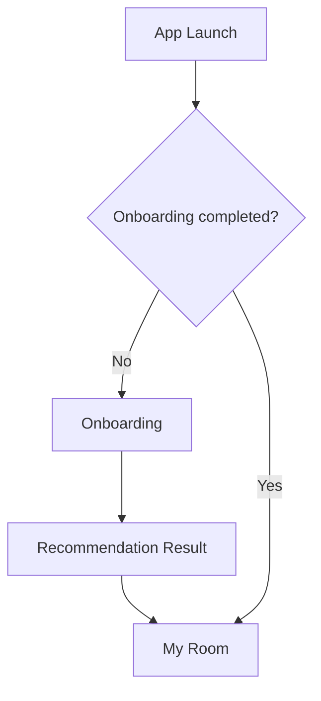
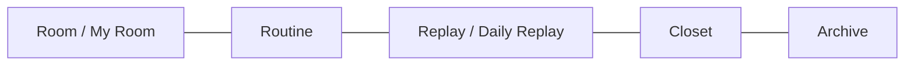
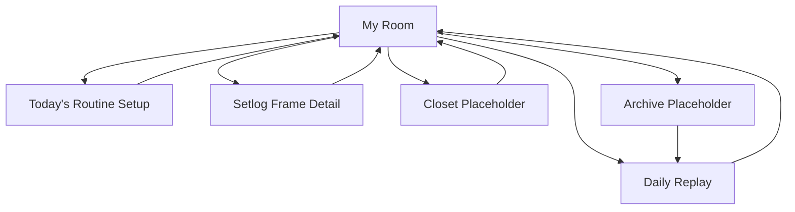

# Roonary Screen Flow
> 목적: MVP 1의 화면 구조와 이동 흐름을 정의한다.

---

## 1. MVP 1 화면 목록

```text
Onboarding
Recommendation Result
My Room
Today's Routine Setup
Setlog Frame Detail
Daily Replay
Closet Placeholder
Archive Placeholder
```

MVP 1에서는 Shared Room 관련 화면을 만들지 않는다.

---

## 2. 첫 실행 흐름



설명:

```text
첫 실행 사용자는 온보딩을 거친다.
온보딩 후 추천 캐릭터/방 결과를 확인한다.
추천 결과를 수락하면 My Room으로 이동한다.
재방문 사용자는 바로 My Room으로 이동한다.
```

---

## 3. 메인 탭 구조

MVP 1의 하단 네비게이션은 다음 구조를 권장한다.

```text
Room
Routine
Replay
Closet
Archive
```

Shared 탭은 MVP 2에서 추가한다.



---

## 4. My Room 중심 흐름



My Room은 MVP 1의 홈 화면이다.

My Room에서 가능한 이동:

```text
오늘의 루틴 설정
Daily Replay 확인
Setlog Frame 상세 확인
Closet placeholder 확인
Archive placeholder 확인
```

---

## 5. 화면별 진입/이탈

### 5.1 Onboarding

진입:

```text
앱 첫 실행
설정 초기화 후 재시작
```

이탈:

```text
모든 질문 답변 -> Recommendation Result
```

뒤로가기 정책:

```text
이전 질문으로 이동 가능
첫 질문에서는 앱 종료 또는 시작 화면 유지
```

---

### 5.2 Recommendation Result

진입:

```text
Onboarding 완료 후
```

표시 정보:

```text
캐릭터 프리셋
동물 타입
기본 색상
방 테마
추천 루틴
```

이탈:

```text
Accept -> My Room
Adjust character -> 간단 선택 UI 또는 결과 화면 내 선택
Adjust room theme -> 간단 선택 UI 또는 결과 화면 내 선택
```

MVP에서는 별도 깊은 편집 화면을 만들지 않아도 된다.

---

### 5.3 My Room

진입:

```text
추천 결과 수락 후
앱 재실행 후
하단 Room 탭 선택
다른 화면에서 Back/Home 선택
```

표시 정보:

```text
날짜
현재 시간
현재 루틴
캐릭터 상태
방 장면
오늘의 루틴 목록
최근 Setlog Frames
```

주요 액션:

```text
Set routines
Select current routine
View Daily Replay
Open Closet
Open Archive
```

---

### 5.4 Today's Routine Setup

진입:

```text
My Room의 Set routines
하단 Routine 탭
```

표시 정보:

```text
루틴 프리셋 목록
선택 여부
현재 루틴 여부
```

이탈:

```text
Save -> My Room
Cancel/Back -> My Room
```

---

### 5.5 Setlog Frame Detail

진입:

```text
My Room의 최근 frame 선택
Daily Replay의 frame 선택
```

표시 정보:

```text
timestamp
routine type
routine status
scene label
variation label
room theme
```

이탈:

```text
Back -> 이전 화면
```

MVP에서는 모달 또는 간단 상세 화면 중 구현이 쉬운 방식을 선택한다.

---

### 5.6 Daily Replay

진입:

```text
My Room의 View Daily Replay
하단 Replay 탭
Archive의 replay 카드 선택
```

표시 정보:

```text
날짜
Routine Summary
Generated Frames
Room/Focus/Wellness/Creativity stats
Archive 저장 상태
```

이탈:

```text
Back -> My Room 또는 이전 화면
Archive -> Archive Placeholder
```

---

### 5.7 Closet Placeholder

진입:

```text
하단 Closet 탭
My Room의 change outfit/room action
```

표시 정보:

```text
현재 캐릭터
현재 프리셋
현재 색상
잠금/준비 중 상태
```

이탈:

```text
Back 또는 Room 탭 -> My Room
```

---

### 5.8 Archive Placeholder

진입:

```text
하단 Archive 탭
Daily Replay의 Archive action
```

표시 정보:

```text
오늘 Daily Replay 카드
과거 기록 placeholder
```

이탈:

```text
Replay card -> Daily Replay
Room 탭 -> My Room
```

---

## 6. MVP 2에서 추가될 화면

MVP 2에서는 다음 화면을 추가한다.

```text
Shared Rooms
Create Shared Room
Invite Link
Join Shared Room
Live Shared Room
Room Setlog
Group Replay
```

MVP 1의 네비게이션은 MVP 2에서 다음처럼 확장될 수 있다.

```text
Room
Routine
Replay
Shared
Closet
Archive
```

---

## 7. 화면 흐름 원칙

```text
My Room을 항상 돌아올 수 있는 중심 화면으로 둔다.
온보딩은 첫 사용 경험을 돕되 길게 붙잡지 않는다.
Routine setup은 빠르게 선택하고 빠져나오는 화면이어야 한다.
Daily Replay는 감성 에세이가 아니라 기록물처럼 보여야 한다.
Closet과 Archive는 MVP 1에서 기능보다 확장 가능성을 보여주는 자리다.
Shared Room은 MVP 1 화면 흐름에 넣지 않는다.
```
